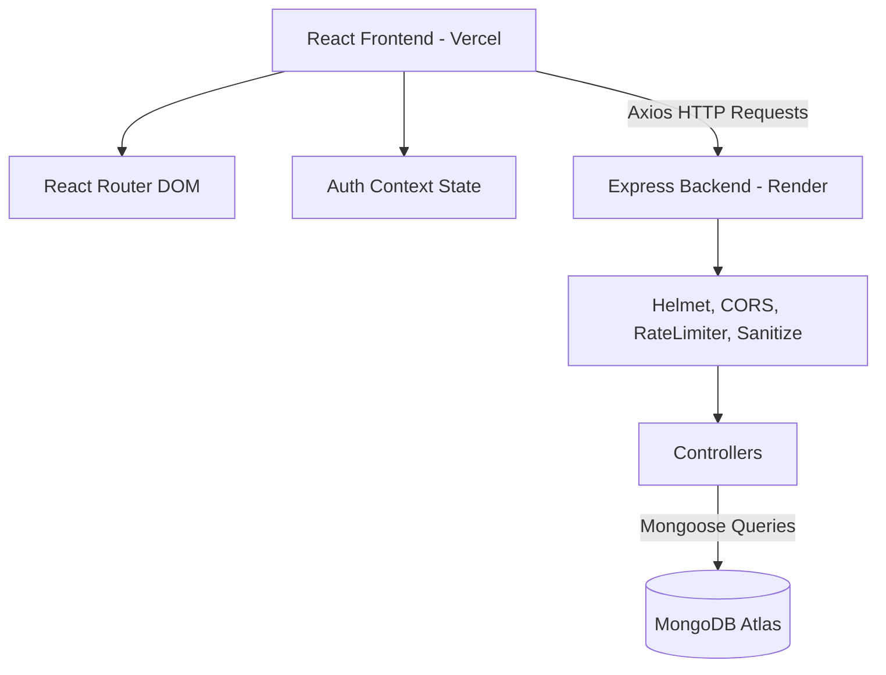

# Restaurant Reservation Management System

A production-ready full-stack web application designed for restaurant managers and customers. This system allows customers to book reservations with automated conflict detection, and administrators to comprehensively manage physical tables and bookings via a centralized dashboard.

## Project Overview

The Restaurant Reservation Management System is built to solve the complex problem of real-time table allocation. It ensures that customers can seamlessly book tables without overbooking, while restaurant staff have absolute control over table availability, capacity planning, and daily reservation monitoring.

## Features

### Customer Features
- **Secure Authentication**: JWT-based login and registration.
- **Reservation Creation**: Select dates, times, and party sizes to automatically find and secure a suitable table.
- **Personal Dashboard**: View upcoming and past reservations.
- **Cancellation**: Easily cancel active reservations.

### Admin Features
- **Role-Based Access Control**: Secure, admin-only routes and APIs.
- **Admin Dashboard**: High-level statistics (Total, Active, Cancelled, Today's reservations).
- **Table Management**: Full CRUD capabilities for physical restaurant tables (Capacity, Status).
- **Reservation Management**: Search, filter, edit, and cancel customer reservations.
- **Conflict Management**: Override and manage any bookings dynamically.

## Tech Stack

### Frontend
- **Framework**: React 19+
- **Build Tool**: Vite
- **Routing**: React Router DOM (with Lazy Loading)
- **State & Forms**: React Hook Form, Context API
- **Styling**: Tailwind CSS
- **Network**: Axios (with Interceptors)

### Backend
- **Runtime**: Node.js
- **Framework**: Express.js
- **Database**: MongoDB (Mongoose ODM)
- **Authentication**: JSON Web Tokens (JWT) & bcryptjs
- **Security**: Helmet, Express Rate Limit, Mongo Sanitize, XSS Clean, CORS

## System Architecture



## Installation

### Backend Setup
1. Navigate to the backend directory:
   ```bash
   cd backend
   ```
2. Install dependencies:
   ```bash
   npm install
   ```
3. Copy the environment variables template:
   ```bash
   cp .env.example .env
   ```
4. Update the `.env` file with your MongoDB URI and JWT Secret.

### Frontend Setup
1. Navigate to the frontend directory:
   ```bash
   cd frontend
   ```
2. Install dependencies:
   ```bash
   npm install
   ```
3. Copy the environment variables template:
   ```bash
   cp .env.example .env
   ```
4. Ensure `VITE_API_URL` points to your backend (e.g., `http://localhost:5000/api`).

## Environment Variables

### Backend (`.env`)
```
PORT=5000
MONGODB_URI=mongodb+srv://...
JWT_SECRET=your_jwt_secret
JWT_EXPIRES_IN=1d
NODE_ENV=development
CLIENT_URL=http://localhost:5173
```

### Frontend (`.env`)
```
VITE_API_URL=http://localhost:5000/api
```

## Running Locally

To run the full stack locally, open two terminal windows:

**Terminal 1 (Backend)**:
```bash
cd backend
npm run dev
```

**Terminal 2 (Frontend)**:
```bash
cd frontend
npm run dev
```
The frontend will be available at `http://localhost:5173`.

## API Endpoints

### Authentication
| Method | Route | Description | Access |
|--------|-------|-------------|--------|
| POST | `/api/auth/register` | Register a new user | Public |
| POST | `/api/auth/login` | Authenticate user and get JWT | Public |
| GET | `/api/auth/me` | Get current user profile | Private |

### Tables (Admin Only)
| Method | Route | Description | Access |
|--------|-------|-------------|--------|
| GET | `/api/tables` | Get all tables | Admin |
| POST | `/api/tables` | Create a new table | Admin |
| PUT | `/api/tables/:id` | Update a table | Admin |
| DELETE | `/api/tables/:id` | Soft delete a table | Admin |

### Customer Reservations
| Method | Route | Description | Access |
|--------|-------|-------------|--------|
| POST | `/api/reservations` | Create a reservation | Customer |
| GET | `/api/reservations` | Get own reservations | Customer |
| DELETE | `/api/reservations/:id` | Cancel a reservation | Customer |

### Admin Reservations
| Method | Route | Description | Access |
|--------|-------|-------------|--------|
| GET | `/api/admin/reservations` | Get all reservations (w/ pagination/search) | Admin |
| GET | `/api/admin/reservations/stats` | Get dashboard statistics | Admin |
| PUT | `/api/admin/reservations/:id` | Update any reservation | Admin |
| DELETE | `/api/admin/reservations/:id` | Cancel any reservation | Admin |

## Reservation Allocation Logic
When a customer requests a reservation, the system:
1. Validates the date and time format.
2. Queries the database for all `ACTIVE` tables with a `capacity >= guests`.
3. Checks existing `ACTIVE` reservations for the requested date and time slot.
4. Filters out any tables that are currently booked for that exact slot.
5. If tables are available, sorts them by capacity (ascending) to assign the most efficiently sized table.
6. If no tables are available, returns a `409 Conflict` error.

## Database Schema

- **User**: Name, Email, Password (hashed), Role (customer/admin)
- **Table**: Table Number, Capacity, isActive
- **Reservation**: User (Ref), Table (Ref), Date, TimeSlot, Guests, Status (ACTIVE/CANCELLED)

### Recommended MongoDB Indexing
To optimize production queries, ensure the following indexes exist in your Atlas cluster:
```javascript
// User Schema
UserSchema.index({ email: 1 }, { unique: true });

// Table Schema
TableSchema.index({ tableNumber: 1 }, { unique: true });
TableSchema.index({ isActive: 1 });

// Reservation Schema
// Compound index for extremely fast conflict detection
ReservationSchema.index({ reservationDate: 1, timeSlot: 1, status: 1 });
ReservationSchema.index({ user: 1 });
```

## Seeding Documentation
To test the admin features, you must manually create an admin user directly in the database (or via an initial seed script):
1. Register a standard user via the UI.
2. Open MongoDB Atlas (or Compass).
3. Find the newly created user in the `users` collection.
4. Update the `role` field from `"customer"` to `"admin"`.
5. Log back in to access the `/admin` dashboard.

## Testing Documentation

### Manual Testing Checklist
- [ ] **Authentication**: Register, login, verify JWT storage, logout.
- [ ] **RBAC**: Attempt to access `/admin` as a customer (should redirect). Attempt to access `/dashboard` without logging in (should redirect to `/login`).
- [ ] **Admin Tables**: Create Table 1 (capacity 4). Verify it appears. Soft delete it, verify status changes to INACTIVE.
- [ ] **Customer Reservation**: Login as customer. Book a table for a date/time. Verify table is assigned.
- [ ] **Conflict Testing**: Book the exact same table/time slot again. Verify the system either assigns a different table or rejects with a Conflict error.
- [ ] **Admin Reservation**: Login as admin. Search for the customer. Cancel their reservation.

## Deployment Links
- **Backend (Render)**: Uses `render.yaml` for zero-downtime automated deployments from Git.
- **Frontend (Vercel)**: Uses `vercel.json` to handle React Router push-state rewriting and security headers.

## Known Limitations
- The system currently assumes a fixed set of time slots (e.g., 06:00 PM, 08:00 PM) rather than dynamic duration-based locking (e.g., locking a table for 90 minutes from a custom start time).

## Future Improvements (Bonus Enhancements)
1. **Email Notifications**: Integrate SendGrid/Nodemailer to send booking confirmations and cancellation receipts.
2. **Real-time Availability**: Implement WebSockets (Socket.io) to visually block out timeslots in real-time if another user books them while browsing.
3. **Analytics Dashboard**: Add charts (Chart.js) to the admin panel showing revenue, popular timeslots, and peak days.
4. **Waitlist System**: Allow users to join a waitlist for fully booked slots, automatically securing the table if a cancellation occurs.
5. **Multi-restaurant Support**: Add a `Restaurant` schema to allow a single instance to manage multiple physical locations.

## Author
Built as a comprehensive demonstration of full-stack architecture, React design patterns, and secure RESTful API development.
